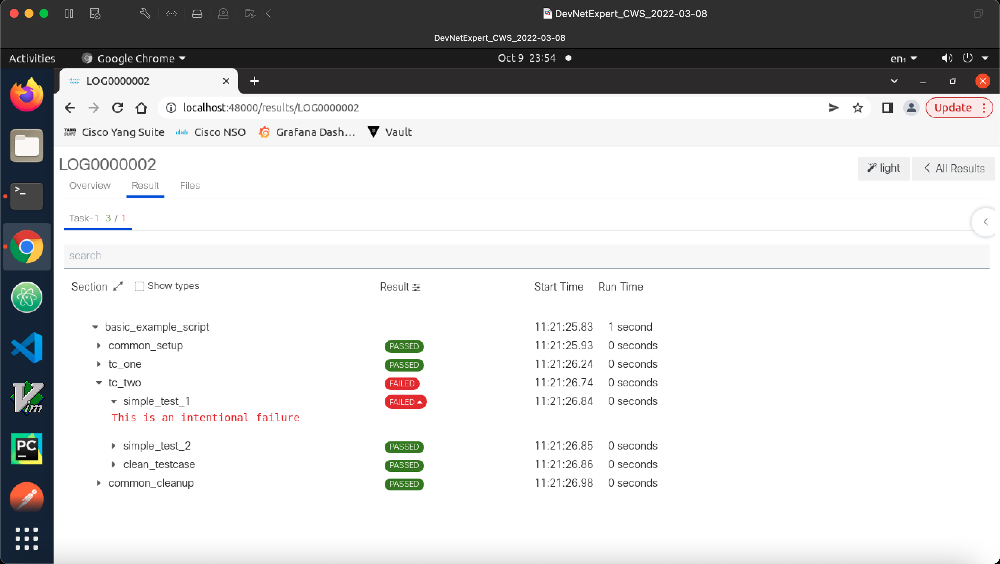

## pyATS for Network Testing with AEtest (Automation Easy test)

pyATS (Python Automated Test Systems) for Network Testing with AEtest (Automation Easy testing)


pyATS: the core framework
pyATS Library: the pyATS standard library (formerly “Genie”)
XPRESSO: the pyATS Web UI Dashboard

### Supported version of Python for pyATS

For pyATS, make sure your have any of the following supported version of Python installed:

- Python 3.7.x
- Python 3.8.x
- Python 3.9.x
- Python 3.10.x

Most of the Linux distributions normally ship with Python pre-installed. However, you can also check out this link to see how to install Python3 on your Linux systems.

[Python 3 Installation & Setup Guide](https://realpython.com/installing-python/#how-to-install-python-on-macos)

Check the Python version to confirm you have Python3 installed. 
```s
$ python3 -V
```

You will also need the Python package manager known as `pip`. It allows you to install and manage libraries and dependencies that aren’t distributed as part of the Python standard libraries. These packages or libraries are constantly built and managed by many Python community members and are published to the Python Package Index (aka PyPI).

[Here](https://realpython.com/what-is-pip/#getting-started-with-pip) is the more information about pip.

PIP installation on Ubuntu 
```s
$ sudo apt install -y python3-pip
```

PIP Installation on CentOS 
```s
$ python3.6 -m ensurepip
```

Also make sure `pip` is up to date. 
```s
$ pip install --upgrade pip setuptools
```

It is also a good practice to use Python virtual environment when you are working with new package as it creates an isolated environment and avoid any project dependency conflicts.
For more information, check out this [link](https://realpython.com/python-virtual-environments-a-primer/).

To create a virtual environment for pyATS, you can name it whatver you like. 

`python3 -m venv /path/to/new/virtual/environment`

```s
$ python3 -m venv pyats
$ source pyats/bin/activate 
```

To deactivate the environment

`$ deactivate`

### pyATS Installation via Python pip

Once you have supported `Python3` and `pip` installed as well as activated the virtual environment you can go ahead and install pyATS. 

You can either choose to install pyATS using the options described in this [link](https://developer.cisco.com/docs/pyats-getting-started/) or perform the full installation. 

```s
$ pip install pyats[full]
```

You can also check if you have latest version of pyats installed. To run the full upgrade, run `$ pip install pyats[full] --upgrade` or follow the method below;

```s
# to check your current pyats version
(pyats)$ pyats version check

# to check if any packages are out-dated
(pyats)$ pyats version check --outdated

# to update version
(pyats)$ pyats version update
```

### pyATS Installation via Docker

Besides installing the pyATS via Python pip, you can also use pre-built docker image which includes both pyATS and the pyATS Library. You can find the image and instructions at https://hub.docker.com/r/ciscotestautomation/pyats.

```s
bash$ docker pull ciscotestautomation/pyats:latest
```
and run the container in shell mode 
```s
$ docker run -it ciscotestautomation/pyats:latest /bin/bash
```

Or you can pull and run a container in one command, please note I am using `latest` tag to run a latest version of pyats container, however you can run any specific version by defining a tag e.g. `21.9-full` image tag. I have also customised other paramters. 
 

```bash
$ docker run -itd --hostname pyats-docker --name pyats-docker \
    -v "$(pwd)":/root \
    -p 48000:48000 \
    ciscotestautomation/pyats:latest
```

You may notice that, I have bind the local host system current working directory to the pyats docker root home directory and map the 48000 port. You can customise these options as you like. 

where; 
- -it: interactive tty 
- -d: detached mode 
- --hostname: hostname of the docker container
- --name: name of the docker container
- -v: docker bind volume, <local-source-path>:<container-targer-path>
- -p: port number, <host-port>:<container-port>
- ciscotestautomation/pyats:latest, <container-image>:<tag>

Since we created a docker container with `48000:48000` port mapping, so to view the pyats logs on the host system, we need to run the following to command to view the logs. 

`pyats logs view --host 0.0.0.0 --port 48000 --no-browser --latest`

Creating pyats-docker container
```bash
(main) expert@expert-cws:~/pyats_aetest$ docker run -itd --hostname pyats-docker --name pyats-docker \
>     -v "$(pwd)":/root \
>     -p 48000:48000 \
>     ciscotestautomation/pyats:latest
Unable to find image 'ciscotestautomation/pyats:latest' locally
latest: Pulling from ciscotestautomation/pyats
c229119241af: Pull complete 
5a3ae98ea812: Pull complete 
46d5c684ee5f: Pull complete 
fdb2b484fc86: Pull complete 
bbf0e1f27c8a: Pull complete 
75bafedb61d2: Pull complete 
20579f09193d: Pull complete 
c9a108280cac: Pull complete 
f79e218b616f: Pull complete 
b1de34dbb9c4: Pull complete 
a3ed95caeb02: Pull complete 
Digest: sha256:6ffc37fe439e1eb7314e9d707a6013e8431214b3db6ff7e022df1c8f25a84a82
Status: Downloaded newer image for ciscotestautomation/pyats:latest
907a57584a096fc0c2355a28787b91271ae61e4de090832c144d34850b884960
(main) expert@expert-cws:~/pyats_aetest$ docker ps
CONTAINER ID   IMAGE                              COMMAND                  CREATED          STATUS          PORTS                                           NAMES
907a57584a09   ciscotestautomation/pyats:latest   "/bin/tini -- /entry…"   14 seconds ago   Up 11 seconds   0.0.0.0:48000->48000/tcp, :::48000->48000/tcp   pyats-docker
(main) expert@expert-cws:~/pyats_aetest$
```

Login to the pyats container and activate the pyats virtual environment.

`docker exec -it pyats-docker /bin/bash`

```bash
(main) expert@expert-cws:~/pyats_aetest$ docker exec -it pyats-docker /bin/bash
root@pyats-docker:/pyats# source bin/activate
(pyats) root@pyats-docker:/pyats# 
```

Check the pyats version 

```bash
(pyats) root@pyats-docker:~# pyats version check
You are currently running pyATS version: 22.9
Python: 3.9.12 [64bit]

  Package              Version
  -------------------- -------
  pyats                22.9   
  pyats.aereport       22.9   
  pyats.aetest         22.9   
  pyats.async          22.9   
  pyats.connections    22.9   
  pyats.datastructures 22.9   
  pyats.easypy         22.9   
  pyats.kleenex        22.9   
  pyats.log            22.9   
  pyats.reporter       22.9   
  pyats.results        22.9   
  pyats.tcl            22.9   
  pyats.topology       22.9   
  pyats.utils          22.9   
  unicon               22.9   
  unicon.plugins       22.9   


(pyats) root@pyats-docker:~# 
```

There you go! you now have working pyats docker container running, you can also clone pyats example and run the job. 

### pyATS Example scripts 

If you want to get started with pyATS, you can download or clone the DevNet community examples from the links below; 

`git clone https://github.com/CiscoTestAutomation/examples`

```bash
(pyats) root@pyats-docker:/pyats# cd
(pyats) root@pyats-docker:~# git clone https://github.com/CiscoTestAutomation/examples
Cloning into 'examples'...
remote: Enumerating objects: 1353, done.
remote: Counting objects: 100% (201/201), done.
remote: Compressing objects: 100% (109/109), done.
remote: Total 1353 (delta 111), reused 126 (delta 81), pack-reused 1152
Receiving objects: 100% (1353/1353), 1.17 MiB | 5.66 MiB/s, done.
Resolving deltas: 100% (682/682), done.
(pyats) root@pyats-docker:~# 
(pyats) root@pyats-docker:~# ls -la
total 24
drwxrwxr-x  4 1001 1002 4096 Oct  9 23:17 .
drwxr-xr-x  1 root root 4096 Oct  9 23:08 ..
-rw-------  1 root root 4501 Oct  9 23:50 .bash_history
drwxr-xr-x  4 root root 4096 Oct  9 11:54 .pyats
drwxr-xr-x 24 root root 4096 Oct  9 23:17 examples
(pyats) root@pyats-docker:~# 
```

As you can see, we have clone the pyats example scripts in the docker root home directory, we can run the below command to run the job. 

`pyats run job examples/basic/basic_example_job.py`

```bash
(pyats) root@pyats-docker:~# pyats run job examples/basic/basic_example_job.py
2022-10-09T23:21:24: %EASYPY-INFO: Starting job run: basic_example_job
2022-10-09T23:21:24: %EASYPY-INFO: Runinfo directory: /root/.pyats/runinfo/basic_example_job.2022Oct09_23:21:23.361688
2022-10-09T23:21:24: %EASYPY-INFO: --------------------------------------------------------------------------------
2022-10-09T23:21:25: %EASYPY-INFO: +------------------------------------------------------------------------------+
2022-10-09T23:21:25: %EASYPY-INFO: |                              Clean Information                               |
2022-10-09T23:21:25: %EASYPY-INFO: +------------------------------------------------------------------------------+
2022-10-09T23:21:25: %EASYPY-INFO: {'bringup': {}, 'cleaners': {}, 'devices': {}}

2022-10-09T23:21:25: %EASYPY-INFO: Starting task execution: Task-1
2022-10-09T23:21:25: %EASYPY-INFO:     test harness = pyats.aetest
2022-10-09T23:21:25: %EASYPY-INFO:     testscript   = /root/examples/basic/basic_example_script.py
2022-10-09T23:21:25: %AETEST-INFO: +------------------------------------------------------------------------------+
2022-10-09T23:21:25: %AETEST-INFO: |                            Starting common setup                             |
2022-10-09T23:21:25: %AETEST-INFO: +------------------------------------------------------------------------------+
2022-10-09T23:21:26: %AETEST-INFO: +------------------------------------------------------------------------------+
2022-10-09T23:21:26: %AETEST-INFO: |                   Starting subsection sample_subsection_1                    |
2022-10-09T23:21:26: %AETEST-INFO: +------------------------------------------------------------------------------+
2022-10-09T23:21:26: %SCRIPT-INFO: Aetest Common Setup 
2022-10-09T23:21:26: %AETEST-INFO: The result of subsection sample_subsection_1 is => PASSED
2022-10-09T23:21:26: %AETEST-INFO: +------------------------------------------------------------------------------+
2022-10-09T23:21:26: %AETEST-INFO: |                   Starting subsection sample_subsection_2                    |
2022-10-09T23:21:26: %AETEST-INFO: +------------------------------------------------------------------------------+
2022-10-09T23:21:26: %SCRIPT-INFO: Inside subsection sample_subsection_2
2022-10-09T23:21:26: %SCRIPT-INFO: Inside class common_setup
2022-10-09T23:21:26: %AETEST-INFO: The result of subsection sample_subsection_2 is => PASSED
2022-10-09T23:21:26: %AETEST-INFO: The result of common setup is => PASSED
2022-10-09T23:21:26: %AETEST-INFO: +------------------------------------------------------------------------------+
2022-10-09T23:21:26: %AETEST-INFO: |                           Starting testcase tc_one                           |
2022-10-09T23:21:26: %AETEST-INFO: +------------------------------------------------------------------------------+
2022-10-09T23:21:26: %AETEST-INFO: +------------------------------------------------------------------------------+
2022-10-09T23:21:26: %AETEST-INFO: |                      Starting section prepare_testcase                       |
2022-10-09T23:21:26: %AETEST-INFO: +------------------------------------------------------------------------------+
2022-10-09T23:21:26: %SCRIPT-INFO: Preparing the test
2022-10-09T23:21:26: %SCRIPT-INFO: section prepare_testcase
2022-10-09T23:21:26: %AETEST-INFO: The result of section prepare_testcase is => PASSED
2022-10-09T23:21:26: %AETEST-INFO: +------------------------------------------------------------------------------+
2022-10-09T23:21:26: %AETEST-INFO: |                        Starting section simple_test_1                        |
2022-10-09T23:21:26: %AETEST-INFO: +------------------------------------------------------------------------------+
2022-10-09T23:21:26: %SCRIPT-INFO: First test section 
2022-10-09T23:21:26: %AETEST-INFO: The result of section simple_test_1 is => PASSED
2022-10-09T23:21:26: %AETEST-INFO: +------------------------------------------------------------------------------+
2022-10-09T23:21:26: %AETEST-INFO: |                        Starting section simple_test_2                        |
2022-10-09T23:21:26: %AETEST-INFO: +------------------------------------------------------------------------------+
2022-10-09T23:21:26: %SCRIPT-INFO: Second test section 
2022-10-09T23:21:26: %AETEST-INFO: The result of section simple_test_2 is => PASSED
2022-10-09T23:21:26: %AETEST-INFO: +------------------------------------------------------------------------------+
2022-10-09T23:21:26: %AETEST-INFO: |                       Starting section clean_testcase                        |
2022-10-09T23:21:26: %AETEST-INFO: +------------------------------------------------------------------------------+
2022-10-09T23:21:26: %SCRIPT-INFO: Pass testcase cleanup
2022-10-09T23:21:26: %AETEST-INFO: The result of section clean_testcase is => PASSED
2022-10-09T23:21:26: %AETEST-INFO: The result of testcase tc_one is => PASSED
2022-10-09T23:21:26: %AETEST-INFO: +------------------------------------------------------------------------------+
2022-10-09T23:21:26: %AETEST-INFO: |                           Starting testcase tc_two                           |
2022-10-09T23:21:26: %AETEST-INFO: +------------------------------------------------------------------------------+
2022-10-09T23:21:26: %AETEST-INFO: +------------------------------------------------------------------------------+
2022-10-09T23:21:26: %AETEST-INFO: |                        Starting section simple_test_1                        |
2022-10-09T23:21:26: %AETEST-INFO: +------------------------------------------------------------------------------+
2022-10-09T23:21:26: %SCRIPT-INFO: First test section 
2022-10-09T23:21:26: %AETEST-ERROR: Failed reason: This is an intentional failure
2022-10-09T23:21:26: %AETEST-INFO: The result of section simple_test_1 is => FAILED
2022-10-09T23:21:26: %AETEST-INFO: +------------------------------------------------------------------------------+
2022-10-09T23:21:26: %AETEST-INFO: |                        Starting section simple_test_2                        |
2022-10-09T23:21:26: %AETEST-INFO: +------------------------------------------------------------------------------+
2022-10-09T23:21:26: %SCRIPT-INFO: Second test section 
2022-10-09T23:21:26: %AETEST-INFO: The result of section simple_test_2 is => PASSED
2022-10-09T23:21:26: %AETEST-INFO: +------------------------------------------------------------------------------+
2022-10-09T23:21:26: %AETEST-INFO: |                       Starting section clean_testcase                        |
2022-10-09T23:21:26: %AETEST-INFO: +------------------------------------------------------------------------------+
2022-10-09T23:21:26: %SCRIPT-INFO: Pass testcase cleanup
2022-10-09T23:21:26: %AETEST-INFO: The result of section clean_testcase is => PASSED
2022-10-09T23:21:26: %AETEST-INFO: The result of testcase tc_two is => FAILED
2022-10-09T23:21:26: %AETEST-INFO: +------------------------------------------------------------------------------+
2022-10-09T23:21:26: %AETEST-INFO: |                           Starting common cleanup                            |
2022-10-09T23:21:26: %AETEST-INFO: +------------------------------------------------------------------------------+
2022-10-09T23:21:27: %AETEST-INFO: +------------------------------------------------------------------------------+
2022-10-09T23:21:27: %AETEST-INFO: |                     Starting subsection clean_everything                     |
2022-10-09T23:21:27: %AETEST-INFO: +------------------------------------------------------------------------------+
2022-10-09T23:21:27: %SCRIPT-INFO: Aetest Common Cleanup 
2022-10-09T23:21:27: %AETEST-INFO: The result of subsection clean_everything is => PASSED
2022-10-09T23:21:27: %AETEST-INFO: The result of common cleanup is => PASSED
2022-10-09T23:21:27: %EASYPY-INFO: --------------------------------------------------------------------------------
2022-10-09T23:21:27: %EASYPY-INFO: Job finished. Wrapping up...
2022-10-09T23:21:28: %EASYPY-INFO: Creating archive file: /root/.pyats/archive/22-Oct/basic_example_job.2022Oct09_23:21:23.361688.zip
2022-10-09T23:21:28: %EASYPY-INFO: +------------------------------------------------------------------------------+
2022-10-09T23:21:28: %EASYPY-INFO: |                                Easypy Report                                 |
2022-10-09T23:21:28: %EASYPY-INFO: +------------------------------------------------------------------------------+
2022-10-09T23:21:28: %EASYPY-INFO: pyATS Instance   : /pyats
2022-10-09T23:21:28: %EASYPY-INFO: Python Version   : cpython-3.9.12 (64bit)
2022-10-09T23:21:28: %EASYPY-INFO: CLI Arguments    : /pyats/bin/pyats run job examples/basic/basic_example_job.py
2022-10-09T23:21:28: %EASYPY-INFO: User             : root
2022-10-09T23:21:28: %EASYPY-INFO: Host Server      : pyats-docker
2022-10-09T23:21:28: %EASYPY-INFO: Host OS Version  : Debian GNU/Linux 11 bullseye (x86_64)
2022-10-09T23:21:28: %EASYPY-INFO: 
2022-10-09T23:21:28: %EASYPY-INFO: Job Information
2022-10-09T23:21:28: %EASYPY-INFO:     Name         : basic_example_job
2022-10-09T23:21:28: %EASYPY-INFO:     Start time   : 2022-10-09 23:21:25.658116+00:00
2022-10-09T23:21:28: %EASYPY-INFO:     Stop time    : 2022-10-09 23:21:27.129384+00:00
2022-10-09T23:21:28: %EASYPY-INFO:     Elapsed time : 1.471268
2022-10-09T23:21:28: %EASYPY-INFO:     Archive      : /root/.pyats/archive/22-Oct/basic_example_job.2022Oct09_23:21:23.361688.zip
2022-10-09T23:21:28: %EASYPY-INFO: 
2022-10-09T23:21:28: %EASYPY-INFO: Total Tasks    : 1 
2022-10-09T23:21:28: %EASYPY-INFO: 
2022-10-09T23:21:28: %EASYPY-INFO: Overall Stats
2022-10-09T23:21:28: %EASYPY-INFO:     Passed     : 3
2022-10-09T23:21:28: %EASYPY-INFO:     Passx      : 0
2022-10-09T23:21:28: %EASYPY-INFO:     Failed     : 1
2022-10-09T23:21:28: %EASYPY-INFO:     Aborted    : 0
2022-10-09T23:21:28: %EASYPY-INFO:     Blocked    : 0
2022-10-09T23:21:28: %EASYPY-INFO:     Skipped    : 0
2022-10-09T23:21:28: %EASYPY-INFO:     Errored    : 0
2022-10-09T23:21:28: %EASYPY-INFO: 
2022-10-09T23:21:28: %EASYPY-INFO:     TOTAL      : 4
2022-10-09T23:21:28: %EASYPY-INFO: 
2022-10-09T23:21:28: %EASYPY-INFO: Success Rate   : 75.00 %
2022-10-09T23:21:28: %EASYPY-INFO: 
2022-10-09T23:21:28: %EASYPY-INFO: +------------------------------------------------------------------------------+
2022-10-09T23:21:28: %EASYPY-INFO: |                             Task Result Summary                              |
2022-10-09T23:21:28: %EASYPY-INFO: +------------------------------------------------------------------------------+
2022-10-09T23:21:28: %EASYPY-INFO: Task-1: basic_example_script.common_setup                                 PASSED
2022-10-09T23:21:28: %EASYPY-INFO: Task-1: basic_example_script.tc_one                                       PASSED
2022-10-09T23:21:28: %EASYPY-INFO: Task-1: basic_example_script.tc_two                                       FAILED
2022-10-09T23:21:28: %EASYPY-INFO: Task-1: basic_example_script.common_cleanup                               PASSED
2022-10-09T23:21:28: %EASYPY-INFO: 
2022-10-09T23:21:28: %EASYPY-INFO: +------------------------------------------------------------------------------+
2022-10-09T23:21:28: %EASYPY-INFO: |                             Task Result Details                              |
2022-10-09T23:21:28: %EASYPY-INFO: +------------------------------------------------------------------------------+
2022-10-09T23:21:28: %EASYPY-INFO: Task-1: basic_example_script
2022-10-09T23:21:28: %EASYPY-INFO: |-- common_setup                                                          PASSED
2022-10-09T23:21:28: %EASYPY-INFO: |   |-- sample_subsection_1                                               PASSED
2022-10-09T23:21:28: %EASYPY-INFO: |   `-- sample_subsection_2                                               PASSED
2022-10-09T23:21:28: %EASYPY-INFO: |-- tc_one                                                                PASSED
2022-10-09T23:21:28: %EASYPY-INFO: |   |-- prepare_testcase                                                  PASSED
2022-10-09T23:21:28: %EASYPY-INFO: |   |-- simple_test_1                                                     PASSED
2022-10-09T23:21:28: %EASYPY-INFO: |   |-- simple_test_2                                                     PASSED
2022-10-09T23:21:28: %EASYPY-INFO: |   `-- clean_testcase                                                    PASSED
2022-10-09T23:21:28: %EASYPY-INFO: |-- tc_two                                                                FAILED
2022-10-09T23:21:28: %EASYPY-INFO: |   |-- simple_test_1                                                     FAILED
2022-10-09T23:21:28: %EASYPY-INFO: |   |-- simple_test_2                                                     PASSED
2022-10-09T23:21:28: %EASYPY-INFO: |   `-- clean_testcase                                                    PASSED
2022-10-09T23:21:28: %EASYPY-INFO: `-- common_cleanup                                                        PASSED
2022-10-09T23:21:28: %EASYPY-INFO:     `-- clean_everything                                                  PASSED
2022-10-09T23:21:28: %EASYPY-INFO: Sending report email...
2022-10-09T23:21:28: %EASYPY-INFO: Missing SMTP server configuration, or failed to reach/authenticate/send mail. Result notification email failed to send.
2022-10-09T23:21:28: %EASYPY-INFO: Done!

Pro Tip
-------
   Try the following command to view your logs:
       pyats logs view

(pyats) root@pyats-docker:~# 
```

If you run this job on your local system, you can simply `pyats logs view` to view the logs via webpage with a graphical view of the pass/fail summary,results table, logs etc. But since this running in a container, so you can run the following command to view the logs on your host system where your pyats-docker is running. 

`pyats logs view --host 0.0.0.0 --port 48000 --no-browser --latest --verbose`

-  --host [host]    Host interface to bind to. Default to: localhost
-  --port [port]    Interface port to bind to. Default to: 0
-  --no-browser     Flag to turn off the default behavior of opening a new browser window.
-  --latest         If provided, open last archive file, else, open result list page.
-  --verbose         Give more output, additive up to 3 times.


```bash
(pyats) root@pyats-docker:~# pyats logs view --host 0.0.0.0 --port 48000 --no-browser --latest --verbose
Logfile: /root/.pyats/archive/22-Oct/basic_example_job.2022Oct09_23:21:23.361688.zip

View at: 
    http://pyats-docker:48000/

Press Ctrl-C to exit

--------------------------------------------------------------------------------

Using selector: EpollSelector

```

Now you can browse to this url `http://localhost:48000/` on your local host system and check the dashboard. You should be able to do this as when we created this pyats-docker we mapped the 48000 port, if you havent do it so, you may need to recreate a docker and map any higher port numbers.



Note: make sure when you finish analysing the logs, close the UI, otherwise you may get the `[Errno 98] Address already in use` erros on the terminal, when you try to access the logs again. 


### References

Cisco pyATS: Network Test & Automation Solution
https://developer.cisco.com/docs/pyats/#!introduction/cisco-pyats-network-test--automation-solution

Getting Started with pyATS
https://developer.cisco.com/docs/pyats-getting-started/

pyATS Command Line Tools
https://pubhub.devnetcloud.com/media/pyats/docs/cli/index.html

AEtest - Test Infrastructure
https://pubhub.devnetcloud.com/media/pyats/docs/aetest/index.html

Cisco Test Automation Platform with pyATS & Genie
https://github.com/CiscoTestAutomation

pyATS Docker hub link
https://hub.docker.com/r/ciscotestautomation/pyats

pyATS Dockerfile and Scripts
https://github.com/CiscoTestAutomation/pyats-docker

pyATS Example Scripts
https://github.com/CiscoTestAutomation/examples


